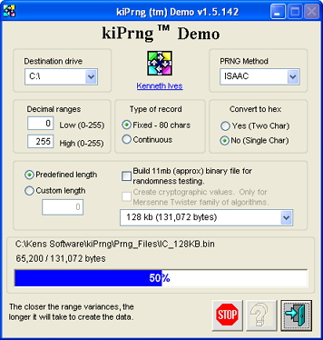



## Random Numbers  15\-Jun\-2012

### Description

Generate cryptographic random numbers using either CryptoAPI, Isaac, Kiss, MWC, Mother of All, or Mersenne Twister family. All of these pass Diehard and ENT randomness tests.

=== 15-Jun-2012 Updated support modules. Minor tweaking in several modules.
 
### More Info
 

             |
---                |---
**Submitted On**   |2012-06-14 18:38:50
**By**             |[Kenaso](https://github.com/Planet-Source-Code/PSCIndex/blob/master/ByAuthor/kenaso.md)
**Level**          |Intermediate
**User Rating**    |4.8 (19 globes from 4 users)
**Compatibility**  |VB 6\.0
**Category**       |[Complete Applications](https://github.com/Planet-Source-Code/PSCIndex/blob/master/ByCategory/complete-applications__1-27.md)
**World**          |[Visual Basic](https://github.com/Planet-Source-Code/PSCIndex/blob/master/ByWorld/visual-basic.md)
**Archive File**   |[Random\_Num2224876142012\.zip](https://github.com/Planet-Source-Code/kenaso-random-numbers-15-jun-2012__1-73502/archive/master.zip)

